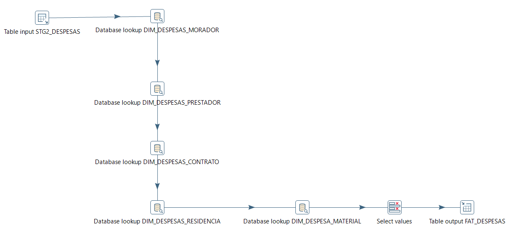

<H1>Capitulo 5 - OLAP // FASE 4</H1>

<H3>Início</H3>

O objetivo deste projeto é adaptar nossa tese do `Construmax` para o ambiente OLAP. Para quem não conhece nossa proposta, deixo aqui este <a href="docs\canvas.pdf">documento explicativo</a>. Sendo breve estamos desenvolvendo uma aplicação que dê mais opção para moradores que desejam realizar uma reforma/obra em sua residência, dando mais oportunidades e crescimento para os prestadores de serviço na área de construção civil.

Temos o seguinte esquema abaixo:

 

Nós queremos transformar as tabelas do nosso modelo de entidade relacional (MER) representadas pelo <b style="color:red">elemento vermelho</b> para o <b style="color:blue">elemento azul</b> que vai agrupar as tabelas dimensionais (STAR). Este processo será dividido em <b>5 etapas</b>.

* A etapa <b>1</b> será a criação das tabelas dos conjuntos ilustrados.
* As etapas <b>2</b>, <b>3</b> e <b>4</b> serão o <b>ETL</b> do projeto. As tabelas MER vão passar por duas fases de <b>Staging</b>. Primeiro vamos extrair os dados para tabelas sem relacionamento (STAGE PHASE 1), depois vamos transforma-las em outras tabelas que prototipam nossas dimensões e fatos (STAGE PHASE 2) e por fim realizar a carga desses dados para as tabelas STAR.
* Todo o processo será feito utilizando a ferramenta do <b>Pentaho Data Integration</b>.
* Na etapa <b>5</b> vamos criar um cubo utilizando o <b>Modrian Workbench</b> e publica-lo no <b>Pentaho BI Server</b>.

 

<h3>ETAPA DE CRIAÇÃO</h3>

Criamos o seguinte modelo de negócios:

O modelo funciona da seguinte forma: Um morador deseja realizar uma reforma, as primeiras ações que ele precisa fazer é informar sua residência e escolher o profissional. Feito isso um contrato é iniciado, ao longo da obra haverá registros de controle de despesas podendo conter a diária do prestador mais algum gasto com material. Terminada a obra o contrato é finalizado.

Para a análise, criamos o seguinte modelo dimensional:   

Nós centralizamos os fatos encima do preço e quantidade dos materiais e sobre valor da diária do profissional. Em relação a qualidade dos dados criamos as dimensões data, material, morador, prestador, residência e contrato.

Segue abaixo a lista dos scripts de criação de todas as tabelas do projeto e carga da dimensão data. Execute-os nessa ordem que não terá problemas.

1. <a href="scripts\sql\01 - Criação tabelas MER.sql">Criação tabelas MER</a>
2. <a href="scripts\sql\02 - Criação tabelas STG para MER.sql">Criação tabelas STG para MER</a>
3. <a href="scripts\sql\03 - Criação tabelas STAR.sql">Criação tabelas STAR</a>
4. <a href="scripts\sql\04 - Criação tabelas STG para STAR.sql">Criação tabelas STG para STAR</a>
5. <a href="scripts\sql\05 - Carga dim_despesas_data.sql">Carga dim_despesas_data</a>

<b>Sobre o Rollback</b>

Caso ocorra algum erro no processo você sempre pode reinicia-lo executando nosso script de <a href="scripts\sql\00 - Rollback.sql">rollback</a>.

<H3>
ETAPA ETL
</H3>
Para que ocorra a extração antes precisamos ter os dados em nossa tabelas, buscando cumprir com a solicitação da atividade, colocamos nossos dados em tabelas de `excel`. Clique <a href="excel">aqui</a> para visualizar os arquivos.

<B>EXTRAÇÃO</B>

Realizamos no total de 18 extrações pegando os dados presentes nas planilhas de excel e incluindo-os dentro das tabelas de início `stg_t2` dentro do banco de dados Oracle. Segue abaixo o fluxo de uma das extrações.

 

<B>TRANSFORMAÇÃO</B>

Após incluído os dados, iniciamos o processo de transformação do qual juntamos as informações das 18 tabelas stg_t2 em 5 tabelas de início `stg2`.  No caso abaixo, STG2_MORADOR será uma junção dos dados que foram armazenados em STG_T2_MORADOR, STG_T2_TP_MOR e STG_T2_ST_MOR.

<B>CARGA</B>

Feita a transformação, chegou a hora de efetuamos a carga dos dados colocados nas tabelas STG2 para nossas dimensões e fato. Abaixo um fluxo que como foi feita a carga das dimensões e fato. 

* Dimensão MORADOR

* Fato DESPESAS

Todo o processo foi automatizado por meio de jobs do Pentaho Data Integration, segue abaixo a esquematização final desta etapa.

  

Montamos este <a href="assets\ETL.mp4">vídeo</a> demonstrando o processo. Lembrando que você pode ter acesso a todos arquivos utilizados dentro deste <a href="repo">repositório</a>.

<H3>
ETAPA OLAP
</H3>
Utilizando o <b>Modrian</b>, pegamos os dados inseridos nas tabelas dimensões e fato do banco para modelar o nosso cubo, segue abaixo como ficou a configuração dentro do software. 

Cubo montado, vamos publica-lo no nosso server BI local. Utilizando a ferramenta analítica <b>saiku</b>, podemos montar diversos relatórios utilizando os dados. No exemplo abaixo, montamos uma tabela com o intuito de observar a quantidade de materiais que prestadores ativos consumiram em obras de apartamentos residenciais ao longo dos anos. Podemos observar que há um detalhamento dos anos em semestres, trimestres e meses assim como uma categorização dos prestadores em 3 níveis (Aprendiz, Pleno e Sênior). Também podemos notar uma separação dos prestadores por estado onde está ocorrendo as obras.

Da mesma forma que fizemos na etapa de ETL, gravamos um <a href="assets\OLAP.mp4">vídeo</a> ilustrando o resultado final do trabalho.

<H3>
Forte Abraço
</H3>

 

